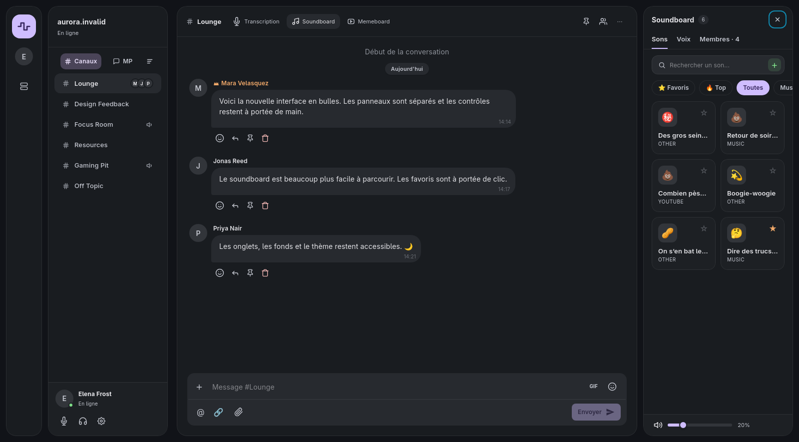
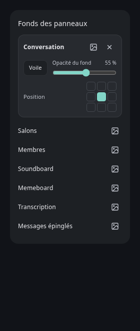

# Interface en bulles — 07/10/2026

Branche : `feat/interface-bulles`. Implémentation du
[plan](superpowers/plans/2026-10-07-interface-bulles.md), d'après la
[maquette](superpowers/plans/2026-10-07-maquette-bulles.png), également fournie
sous `Capture d'écran_20261007_100807.png`.

## Utilisation

Sur ordinateur, quatre espaces séparés composent la fenêtre : rail de
navigation, salons, conversation et panneau latéral. Les bulles ont un rayon
de 20 px et un écart de 12 px ; les cartes internes utilisent un rayon de 14 px.

Le rail permet de replier les salons, ouvrir le compte et l'administration
(si autorisée). La carte de profil au pied des salons réunit
les commandes audio et le raccrochage lorsqu'un appel est actif. Les avatars
vocaux restent sur la ligne du salon ; un clic les déplie. Paramètres est
affiché dans cette carte lorsque le menu est déployé ; lorsque le menu est
compact ou masqué, le rail prend le relais avec ce même accès.

Les onglets de conversation ouvrent transcription (salon vocal), soundboard
ou memeboard. Épinglés et membres utilisent le même panneau ; un nouveau
choix remplace le précédent. Le menu ⋯ réunit les actions de salon autorisées
et les options du partage. Le nom du serveur et son indicateur en ligne
restent visibles ; aucun nombre de présences n'est inventé sans données.
Les libellés des onglets restent visibles sur ordinateur ; l’en-tête passe
sur plusieurs lignes lorsque la largeur disponible ne suffit plus.

La largeur du panneau est comprise entre 300 et 520 px, 360 px par défaut.
La poignée accepte le pointeur, les flèches, Origine / Fin et le double-clic
pour réinitialiser. Échap ferme depuis le panneau et restitue le focus à
l'élément qui l'a ouvert. Sous 1100 px, le menu devient compact et le panneau
se superpose au chat. Cette adaptation ne modifie pas la préférence du menu.

Le soundboard affiche deux colonnes, conserve Favoris / Top / Toutes et les
catégories, et place le volume en pied. La saisie desktop utilise deux lignes :
texte, GIF, emoji ; puis mention, import vidéo par lien, fichier, sondage et Envoyer.
Le bouton Envoyer reste désactivé à vide. Les actions des messages passent
sous leur contenu. Sur téléphone, la coque, la saisie et la feuille de
panneau existantes restent utilisées.

Les fonds se choisissent dans **Réglages → Apparence**, par portée : chat,
salons et chacun des panneaux. Le thème et l'accent restent personnalisables.
Les pixels du partage et du lecteur natifs gardent un rectangle ; le panneau
CSS superposé entre dans le calcul des zones masquées envoyé à Rust.

## Stockage et compatibilité

`useLayoutStore` persiste `sion-layout` version 6 : `panneau` et
`largeurPanneau` remplacent la dock à trois zones, ses cartes flottantes et
son mode édition. Le partage flottant conserve ses propres réglages.

La migration reprend le panneau actif valide de droite (sinon le premier
valide), sa largeur, les préférences de sidebar, les fonds et la disposition
du partage. Les identifiants obsolètes, dont `voice`, sont écartés. Les
valeurs hors bornes et une ancienne liste de panneaux abîmée sont réparées.

L'export `.sionprofil` conserve thème, accent, fonds et sons. L'ancienne
section `layout` reste lisible à l'import et est ignorée, sans changer la
largeur ou le panneau courant. Ctrl+B et Ctrl+Maj+P restent disponibles ;
Ctrl+Maj+L et les presets de disposition sont retirés.

## Vérifications du 07/10

- TypeScript et compilation de production : réussis.
- ESLint : 0 erreur, 37 avertissements déjà présents dans le projet.
- Vitest : **440 tests réussis**, 5 ignorés, 66 fichiers réussis.
- Tests Rust : **172 réussis**, 5 ignorés ; sources Rust identiques à `main`,
  exécution dans le dépôt principal pour réutiliser les dépendances compilées.
- Chromium, composants réels avec données fictives : vues à 1600, 1000,
  768 et 390 px ; cinq panneaux, filtres de sons, redimensionnement clavier,
  Échap / focus, activation de l'envoi, thème clair / accent, feuille mobile.
  Aucune erreur React observée.
- WebKitGTK 4.1 sous Wayland : quatre bulles et six cartes de son rendues.
  CPU moyen du WebKitWebProcess : **9,73 % d’un cœur sur 60 s** au repos
  (données fictives, fond statique, sans appel). Cette mesure d’aperçu est
  sous le seuil de 27 % du plan ; elle ne remplace pas une mesure de la
  session Tauri avec un fond animé.
- Android : APK debug ARM64 compilé avec les mêmes moteurs Rust.
  Artefact : `src-tauri/gen/android/app/build/outputs/apk/universal/debug/`
  `app-universal-debug.apk`. Aucun appareil n’a été modifié ; validation
  visuelle sur téléphone réel encore à faire.
- Régression vidéo : test du trou sous un panneau positionné par CSS entre
  les points de contrôle, et exclusion du panneau hors du lecteur plein écran.

Les vérifications réelles en appel (micro / F8, sons, partage reçu), les
transitions du lecteur et le placement HWND Windows restent à effectuer.
Les aperçus avec données fictives ne valident pas ces fonctions matérielles.
La branche ne doit pas être fusionnée dans `main` avant la 2.0.0 finale.

## Retouches après comparaison à la maquette

D’après la capture annotée `Capture d'écran_20261007_133803.png` :

- Contours des bulles, cartes et séparateurs adoucis avec le token de thème
  `color-border`, au lieu de `color-outline-variant`.
- Un seul accès Paramètres visible : profil en mode déployé, rail en mode
  compact ou masqué. L’accès reste disponible dans une fenêtre étroite.
- Recherche commune aux sons et memes, fond `surface-container-high`,
  bouton + vert intégré au champ, affiché selon les mêmes autorisations.
- Fonds `surface-container` du profil et du pied de volume du soundboard.
- Icône de note de musique dans l’onglet Soundboard, comme la référence.
- Couleur d’accent sur les onglets sélectionnés (texte et icône), la croix
  de fermeture des panneaux sur ordinateur et téléphone, et les contours
  de focus clavier des commandes de panneau.

Vérifications : compilation TypeScript, tests concernés, aperçus sombre et
clair ; recherche et filtres, ajout intégré, accès Paramètres unique à
1600 / 1000 / 768 px, feuille téléphone à 390 px. Aperçu WebKitGTK actualisé.
La mesure CPU de 60 secondes ci-dessus est celle de l’implémentation initiale.
L’accent des onglets et de la fermeture a été vérifié dans Chromium avec
violet, vert et orange, en thème clair et sombre ; le focus a également été
contrôlé dans WebKitGTK.

D’après `Capture d'écran_20261007_162434.png` :

- Micro et casque accessibles dans le profil réduit, avec leur état muet /
  sourdine et le raccrochage pendant un appel. Paramètres conserve son accès
  unique dans le rail.
- Bouton d’insertion de lien avec une icône SVG monochrome, au lieu de
  l’emoji coloré qui donnait l’impression d’un bouton sélectionné.
- Libellés Transcription, Soundboard et Memeboard conservés sous 1350 px,
  avec retour à la ligne de l’en-tête si nécessaire.

Compilation de production réussie, commandes audio réduites testées avec
et sans appel, insertion Markdown toujours vérifiée. Rendu contrôlé dans
l’application WebKitGTK ouverte à 1280 px avec le soundboard affiché.

D’après `Capture d'écran_20261007_170710.png` : le + quitte le champ de
message sur ordinateur. L’import vidéo par lien remplace le raccourci
Markdown ; un bouton Sondage ouvre directement la création dans le salon
courant. Le trombone ouvre directement le sélecteur de fichiers. L’import
vidéo conserve son chargement différé et ajoute le fichier au brouillon.
Les actions respectent les autorisations d’envoi ; yt-dlp reste absent sur
Android et le téléphone conserve son menu trombone.

D’après `Capture d'écran_20261007_171041.png` : raccrocher utilise un combiné
téléphonique aux traits rouges sur fond transparent dans la carte de profil,
en mode réduit comme déployé.

D’après `Capture d'écran_20261007_171442.png` : le raccourci CC est retiré de
la carte de profil. L’onglet Transcription de l’en-tête reste disponible
pendant un appel, y compris lorsqu’on consulte un autre salon.

D’après `Capture d'écran_20261007_172108.png` : les réglages de fond ne se
tassent plus dans une capsule à côté du nom du panneau. Un fond configuré
affiche une carte avec le titre et les actions en haut, le mode Voile / Flou
et l’opacité chiffrée sur une ligne, puis une grille de position agrandie.
Les panneaux sans fond conservent une ligne simple pour choisir une image.

Aperçu Chromium à 280 px : aucun débordement ; commandes contenues dans la
carte ; bascule Voile / Flou, changement d’opacité, position et retrait du
fond vérifiés. Compilation de production réussie.

Le bouton de partage d’écran utilise la couleur d’accent lorsqu’il est
disponible. Pendant un partage, l’icône devient rouge avec un fond légèrement
teinté, pour distinguer l’action d’arrêt.
